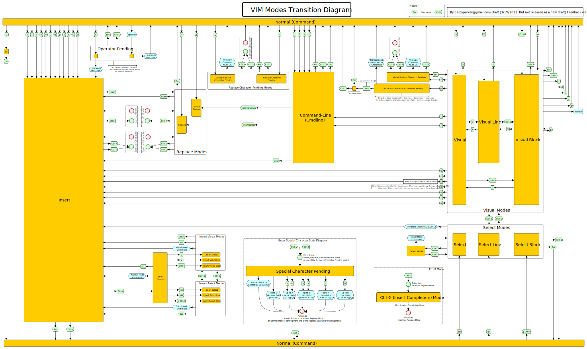

### Incoplete guide to Vim

<code>{command}{motion}{command}</code>

**Modes**

`i` - insert mode

`v` - visual mode

`:` - command mode

`esc` - normal mode (default)

**Commands**

`:q` - quit

`:w` - write

`:wq` - write and quit

`:q!` - quit without saving

**Normal mode**

`h` or `left` - cursor left

`j` or `down` - cursor down

`k` or `up` - cursor up

`l` or `right` - cursor right

`$` - go to end of line

`0` - go to start of line

`_` - go to start of line (with padding)

`w` - go to start of next word

`b` - go to start of previous word

`f` - find character on line

`F` - find character on line backwards

`/` - search

**Visual mode**

`v` - start visual mode

`V` - start line visual mode

`ctrl` + `v` - start block visual mode

**Enter insert mode**

`i` - insert before cursor

`a` - insert after cursor

`o` - insert new line below

`O` - insert new line above

**Copy and paste**

`y` - yank (copy)

`p` - paste

`d` - delete and copy selection

`x` - delete and copy character under cursor

<!-- this is a mirror -->

<!-- this is the source -->
[VIM Modes Transition Diagram]: https://rawgit.com/darcyparker/1886716/raw/eab57dfe784f016085251771d65a75a471ca22d4/vimModeStateDiagram.svg
